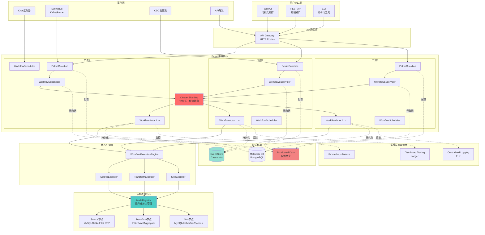
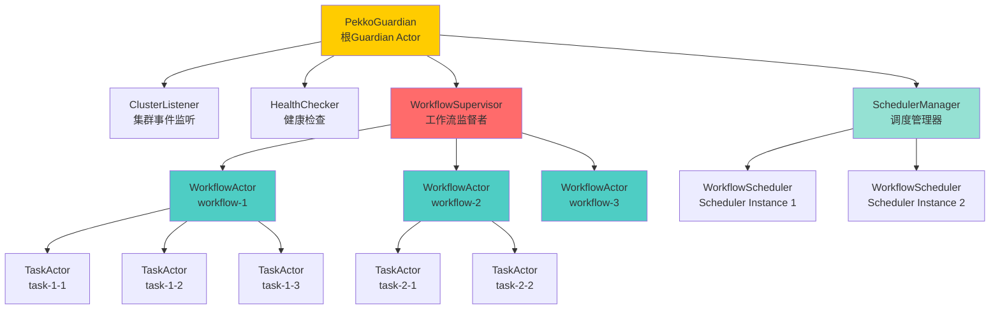
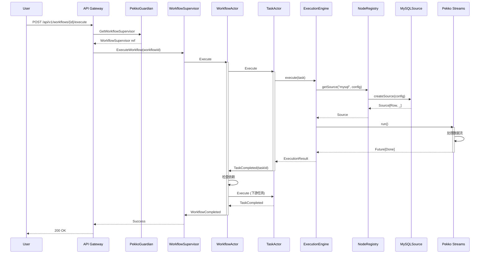
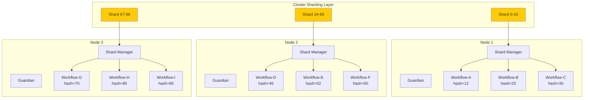
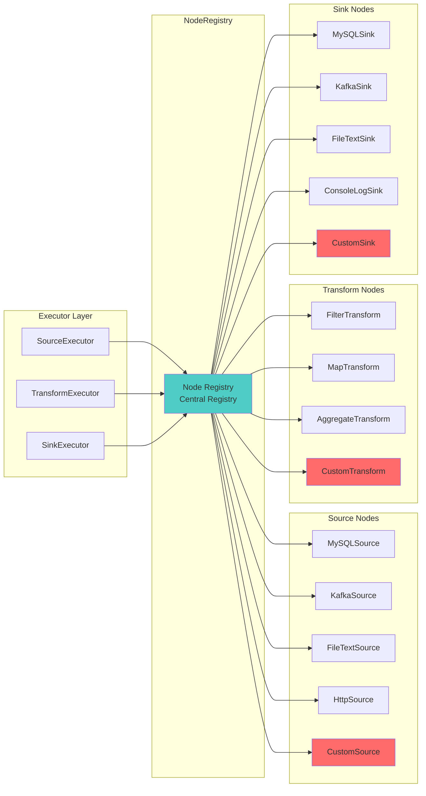
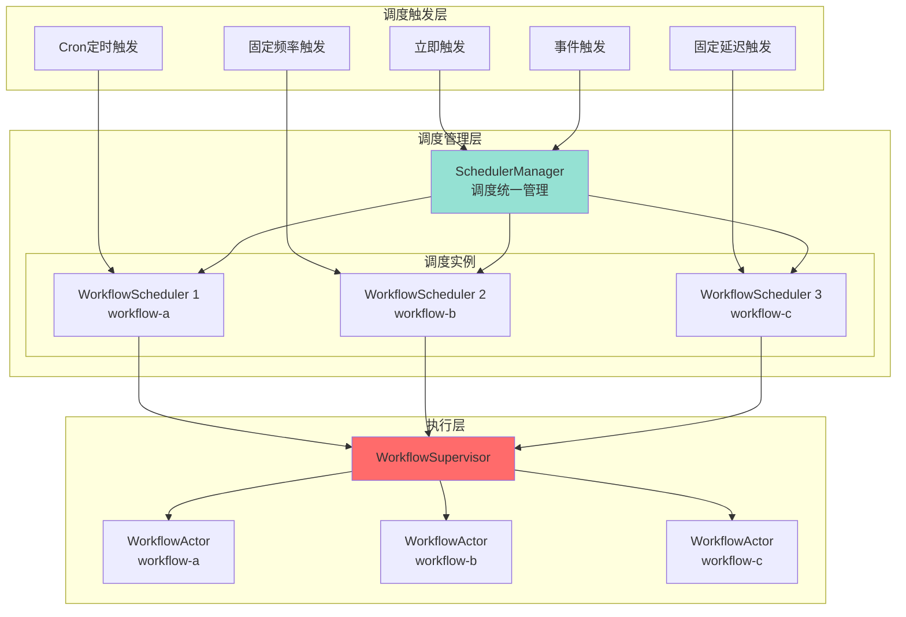
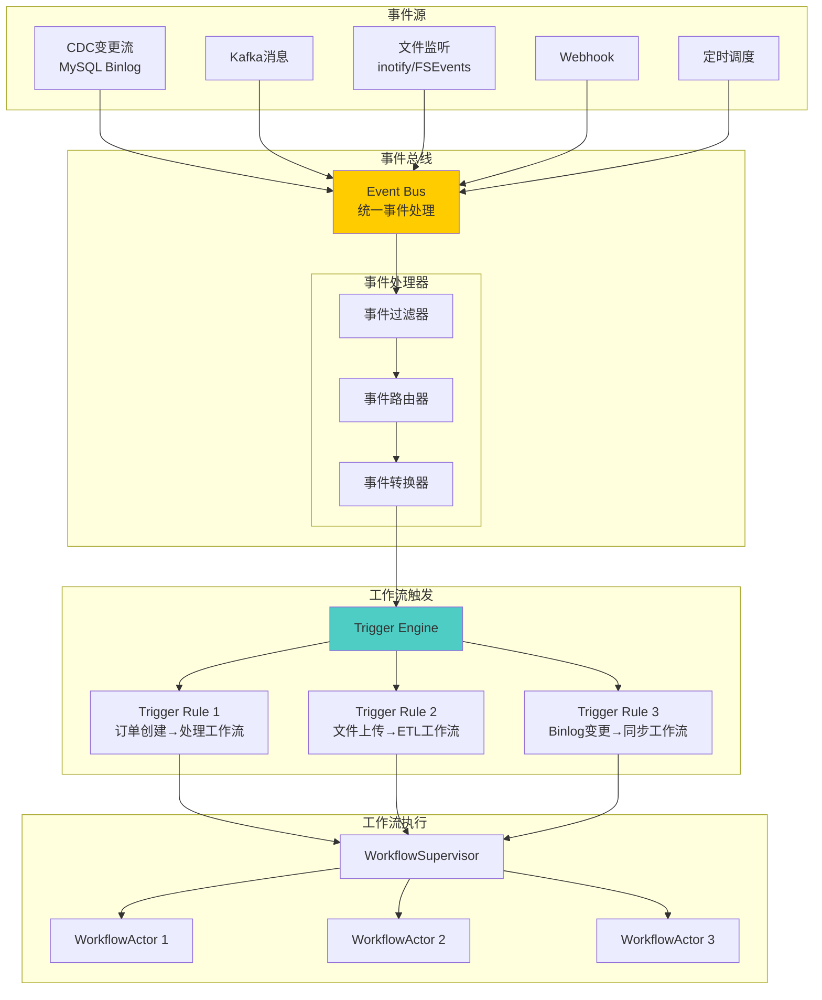
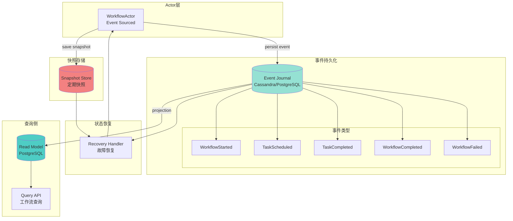
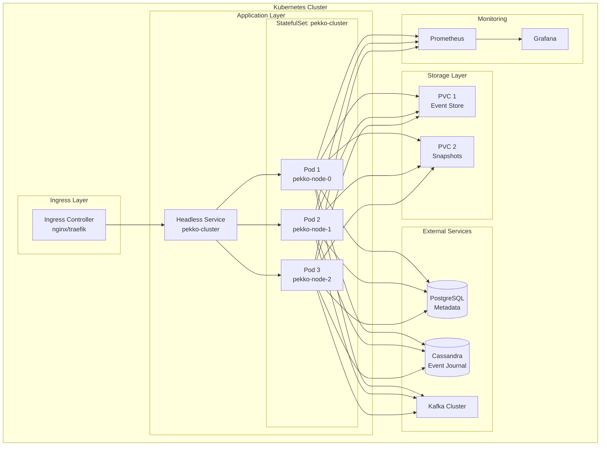

# 架构图详解

> 配套文档：从DolphinScheduler到Pekko - 战略篇

本文档提供详细的系统架构图和组件交互图。

---

## 系统架构全景图



---

## Actor层级结构图



---

## 工作流执行时序图



---

## 集群分片机制图



### 分片策略说明

```scala
// WorkflowId → Shard映射
workflowId.hashCode % 100 → Shard[0-99]

// 例如:
"workflow-abc".hashCode % 100 = 45 → Shard45 → Node2
"workflow-xyz".hashCode % 100 = 12 → Shard12 → Node1
```

**优势**：
- 自动负载均衡
- 同一workflow的消息总是路由到同一Actor
- 节点故障时自动rebalance

---

## 节点注册系统图



### 注册机制

```scala
// 1. 内置节点自动注册
object NodeRegistry {
  private val sources = Map(
    "mysql" -> MySQLSource,
    "kafka" -> KafkaSource,
    "file" -> FileTextSource,
    "http" -> HttpSource
  )
  
  // 2. 动态注册自定义节点
  def register(nodeType: String, node: NodeSource): Unit = {
    sources += (nodeType -> node)
  }
  
  // 3. 获取节点
  def getSource(nodeType: String, config: SourceConfig): Source[_, _] = {
    sources.get(nodeType)
      .map(_.createSource(config))
      .getOrElse(throw new IllegalArgumentException(s"Unknown: $nodeType"))
  }
}
```

---

## 调度器架构图



### 调度类型说明

| 调度类型 | 说明 | 使用场景 |
|---------|------|---------|
| **Cron** | 基于Cron表达式 | 每天凌晨2点执行 |
| **Fixed Rate** | 固定频率（不考虑执行时间） | 每小时执行一次 |
| **Fixed Delay** | 固定延迟（上次执行完后延迟） | 执行完成后等待30分钟 |
| **Immediate** | 立即执行一次 | 手动触发 |
| **Event** | 事件驱动触发 | 数据到达时执行 |

---

## 事件驱动架构图（规划中）



---

## 持久化架构图（规划中）



### 事件溯源优势

1. **完整历史**：每个状态变更都被记录
2. **时间旅行**：可以回溯到任意时间点的状态
3. **审计友好**：天然支持审计需求
4. **故障恢复**：通过重放事件恢复状态
5. **CQRS支持**：命令和查询分离

---

## 监控与可观测性架构图

```mermaid
graph TB
    subgraph "Pekko应用"
        WF1[WorkflowActor 1]
        WF2[WorkflowActor 2]
        WF3[WorkflowActor 3]
        Streams[Pekko Streams]
    end
    
    subgraph "指标采集"
        Metrics[Prometheus Metrics<br/>Cinnamon/Kamon]
        
        subgraph "指标类型"
            M1[Actor Mailbox Size]
            M2[Message Processing Time]
            M3[Stream Throughput]
            M4[Error Rate]
            M5[Cluster Health]
        end
    end
    
    subgraph "分布式追踪"
        Tracing[OpenTelemetry/Jaeger]
        
        subgraph "追踪内容"
            T1[Workflow Execution]
            T2[Task Dependencies]
            T3[External API Calls]
            T4[Database Queries]
        end
    end
    
    subgraph "日志聚合"
        Logging[ELK/Loki]
        
        subgraph "日志类型"
            L1[Application Logs]
            L2[Actor Lifecycle]
            L3[Error Logs]
            L4[Audit Logs]
        end
    end
    
    subgraph "可视化与告警"
        Grafana[Grafana Dashboard]
        Alertmanager[Alert Manager]
    end
    
    WF1 --> Metrics
    WF2 --> Metrics
    WF3 --> Metrics
    Streams --> Metrics
    
    Metrics --> M1
    Metrics --> M2
    Metrics --> M3
    Metrics --> M4
    Metrics --> M5
    
    WF1 --> Tracing
    WF2 --> Tracing
    WF3 --> Tracing
    
    Tracing --> T1
    Tracing --> T2
    Tracing --> T3
    Tracing --> T4
    
    WF1 --> Logging
    WF2 --> Logging
    WF3 --> Logging
    
    Logging --> L1
    Logging --> L2
    Logging --> L3
    Logging --> L4
    
    Metrics --> Grafana
    Tracing --> Grafana
    Logging --> Grafana
    
    Grafana --> Alertmanager
    
    style Metrics fill:#4ecdc4
    style Tracing fill:#95e1d3
    style Logging fill:#f38181
    style Grafana fill:#ffcc00
```



---

## 对比：传统架构 vs Pekko架构

### 传统DolphinScheduler架构

```
┌─────────────────────────────────────┐
│           MasterServer              │
│  (轮询DB, 中心化调度)                 │
└───────────────┬─────────────────────┘
                │
                ▼
        ┌───────────────┐
        │   Database    │◄─── 所有状态存储
        │   (轮询中心)   │     高频查询
        └───────────────┘
                │
                ▼
┌───────────────────────────────────────┐
│        WorkerServer Cluster            │
│  (被动等待任务分配)                     │
└───────────────────────────────────────┘

问题：
❌ Master轮询DB（延迟1-5秒）
❌ DB成为瓶颈
❌ Master单点故障（恢复30-60秒）
❌ Worker被动接收任务
```

### Pekko架构

```
┌──────────┐    ┌──────────┐    ┌──────────┐
│  Node 1  │◄──►│  Node 2  │◄──►│  Node 3  │
│  Guardian│    │  Guardian│    │  Guardian│
│  ├─WF1   │    │  ├─WF2   │    │  ├─WF3   │
│  └─WF4   │    │  └─WF5   │    │  └─WF6   │
└──────────┘    └──────────┘    └──────────┘
     ▲               ▲               ▲
     └───────────────┴───────────────┘
            Cluster Sharding
           (消息驱动, 无轮询)
                  │
                  ▼
        ┌──────────────────┐
        │  Event Store     │◄─── 事件持久化
        │  (仅追加写入)     │     无频繁查询
        └──────────────────┘

优势：
✅ 消息驱动（延迟<10ms）
✅ 无中心化（无单点）
✅ 自动故障恢复（<1秒）
✅ 工作流自主执行
```

---

## 部署架构图

### Kubernetes部署



### 配置示例

```yaml
apiVersion: apps/v1
kind: StatefulSet
metadata:
  name: pekko-cluster
spec:
  serviceName: pekko-cluster
  replicas: 3
  selector:
    matchLabels:
      app: pekko-scheduler
  template:
    metadata:
      labels:
        app: pekko-scheduler
    spec:
      containers:
      - name: pekko
        image: pekko-scheduler:latest
        ports:
        - containerPort: 2551
          name: pekko-remote
        - containerPort: 8080
          name: http
        env:
        - name: PEKKO_CLUSTER_BOOTSTRAP_SERVICE_NAME
          value: "pekko-cluster"
        resources:
          requests:
            memory: "2Gi"
            cpu: "1000m"
          limits:
            memory: "4Gi"
            cpu: "2000m"
```

---

## 总结

本文档提供了完整的系统架构视图，涵盖：

1. **系统全景**：端到端的组件关系
2. **Actor层级**：清晰的监督树结构
3. **时序交互**：消息流转过程
4. **集群分片**：分布式负载均衡
5. **节点注册**：插件化扩展机制
6. **调度架构**：多种触发方式
7. **事件驱动**：未来架构演进
8. **持久化**：事件溯源设计
9. **可观测性**：监控告警体系
10. **部署方案**：Kubernetes生产环境

这些架构图展示了基于Pekko构建的任务调度平台如何通过**Actor模型**、**集群化**、**事件驱动**实现下一代调度系统的愿景。

---

**返回主文档**: [01_strategy_pekko_vs_dolphinscheduler.md](./01_strategy_pekko_vs_dolphinscheduler.md)
