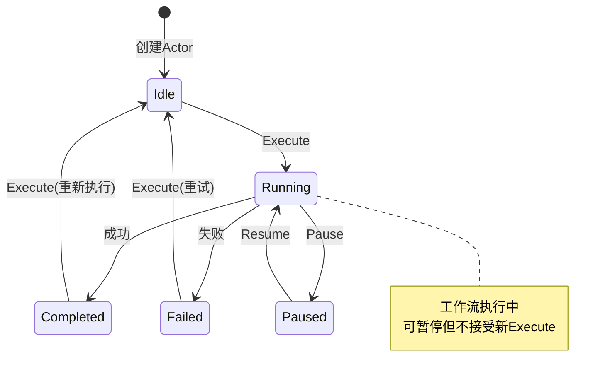

# Actor模型深度解析：重新定义任务调度系统的并发模型

> **系列文章：构建下一代任务调度平台**  
> 第二篇：架构篇 - Actor模型在任务调度中的深度应用

---

## 📋 目录

- [引言](#引言)
- [Actor模型基础](#actor模型基础)
- [WorkflowActor设计详解](#workflowactor设计详解)
- [监督策略与错误恢复](#监督策略与错误恢复)
- [消息传递模式](#消息传递模式)
- [状态管理](#状态管理)
- [实战案例与最佳实践](#实战案例与最佳实践)

---

## 引言

在[第一篇战略篇](./01_strategy_pekko_vs_dolphinscheduler.md)中，我们从宏观层面分析了为什么选择Pekko来构建下一代任务调度平台。本文将深入Actor模型的内核，通过实际代码示例，展示如何利用Actor模型解决任务调度系统中的核心问题。

### 本文目标

- 🎯 **理解Actor模型**：从理论到实践
- 🛠️ **掌握设计模式**：WorkflowActor的设计思想
- 🔧 **学习监督策略**：故障恢复机制
- 💬 **消息传递实战**：不同的交互模式
- 📊 **状态管理技巧**：有状态的Actor设计

---

## Actor模型基础

### 什么是Actor模型？

Actor模型是一种**并发计算模型**，由Carl Hewitt在1973年提出。核心概念：

- **Actor是最小的计算单元**
- **Actor之间通过消息通信**
- **每个Actor有自己的邮箱**
- **Actor处理消息时是串行的（无锁）**

### Actor模型 vs 传统线程模型

```
传统线程模型：
┌──────────┐    ┌──────────┐
│  Thread1 │◄──►│  Thread2 │
└──────────┘    └──────────┘
      ↓              ↓
  ┌────────────────────┐
  │   Shared State     │  ← 需要锁保护
  └────────────────────┘

问题：竞态条件、死锁、难调试、扩展性差

Actor模型：
┌──────────┐    ┌──────────┐
│  Actor1  │───►│  Actor2  │
│  State1  │    │  State2  │
│  Mailbox │◄───│  Mailbox │
└──────────┘    └──────────┘

优势：无共享状态、无锁并发、位置透明、天然分布式
```

### Pekko Actor API速览

```scala
import org.apache.pekko.actor.typed._
import org.apache.pekko.actor.typed.scaladsl._

// 1. 定义消息协议
sealed trait Command
case class DoSomething(data: String) extends Command

// 2. 创建Actor Behavior
def myActor(): Behavior[Command] = Behaviors.setup { context =>
  Behaviors.receiveMessage {
    case DoSomething(data) =>
      context.log.info(s"Processing: $data")
      Behaviors.same
  }
}

// 3. 生成Actor实例
val system = ActorSystem(myActor(), "MySystem")

// 4. 发送消息
system ! DoSomething("hello")
```

---

## WorkflowActor设计详解

### 设计目标

WorkflowActor代表一个工作流实例，负责：

1. **管理生命周期**：创建、执行、暂停、恢复、停止
2. **维护执行状态**：Idle、Running、Paused、Completed、Failed
3. **收集执行日志**：实时记录执行过程
4. **处理异步结果**：集成Future和回调
5. **支持状态查询**：实时状态和日志查询

### 消息协议设计

```scala
object WorkflowActor {
  
  // ===== 命令消息 =====
  sealed trait Command
  
  case class Execute(replyTo: ActorRef[ExecutionResponse]) extends Command
  case object Pause extends Command
  case object Resume extends Command
  case object Stop extends Command
  case class GetStatus(replyTo: ActorRef[StatusResponse]) extends Command
  case class GetLogs(replyTo: ActorRef[LogsResponse]) extends Command
  
  // 内部消息（私有）
  private case class ExecutionCompleted(result: ExecutionResult) extends Command
  private case class ExecutionFailed(error: Throwable) extends Command
  
  // ===== 响应消息 =====
  sealed trait Response
  
  case class ExecutionResponse(executionId: String, status: String) extends Response
  case class StatusResponse(
    workflowId: String,
    state: WorkflowState,
    currentExecutionId: Option[String],
    logs: List[String]
  ) extends Response
}
```

**设计要点**：

✅ Command和Response分离  
✅ 私有内部消息处理异步结果  
✅ 使用sealed trait确保类型安全  
✅ 包含replyTo支持请求-响应

### 状态机设计



### 核心实现

#### 1. Actor构造函数

```scala
def apply(
  workflow: WorkflowDSL.Workflow,
  executionEngine: WorkflowExecutionEngine
)(implicit ec: ExecutionContext): Behavior[Command] = {
  idle(workflow, executionEngine, List.empty)
}
```

#### 2. Idle状态 - 关键实现

```@/Users/xujiawei/magic/scala-workbench/pekko-reference/pekko-server/src/main/scala/cn/xuyinyin/magic/workflow/actors/WorkflowActor.scala#76:129
private def idle(
  workflow: WorkflowDSL.Workflow,
  executionEngine: WorkflowExecutionEngine,
  logs: List[String]
)(implicit ec: ExecutionContext): Behavior[Command] = {
  Behaviors.setup { context =>
    context.log.info(s"WorkflowActor created for: ${workflow.id}")
    
    Behaviors.receiveMessage {
      case Execute(replyTo) =>
        context.log.info(s"Starting workflow execution: ${workflow.id}")
        val executionId = s"exec_${System.currentTimeMillis()}"
        
        // 立即回复：执行已开始
        replyTo ! ExecutionResponse(executionId, "started")
        
        // 异步执行工作流
        val newLogs = scala.collection.mutable.ListBuffer[String]()
        newLogs ++= logs
        
        // 🔑 关键：pipeToSelf模式
        context.pipeToSelf(
          executionEngine.execute(
            workflow,
            executionId,
            msg => {
              newLogs += s"[${java.time.Instant.now()}] $msg"
              context.log.info(s"[$executionId] $msg")
            }
          )
        ) {
          case Success(result) => ExecutionCompleted(result)
          case Failure(ex) => ExecutionFailed(ex)
        }
        
        // 转换到Running状态
        running(workflow, executionEngine, executionId, newLogs.toList)
      
      case GetStatus(replyTo) =>
        replyTo ! StatusResponse(workflow.id, Idle, None, logs)
        Behaviors.same
      
      case Stop =>
        context.log.info(s"Stopping workflow actor: ${workflow.id}")
        Behaviors.stopped
      
      case _ =>
        context.log.warn("Unexpected message in idle state")
        Behaviors.same
    }
  }
}
```

**设计亮点**：

1. **pipeToSelf模式**：安全地将Future转换为Actor消息
2. **立即响应**：先回复`started`，再异步执行
3. **状态转换**：返回新Behavior携带新状态

#### 3. Running状态处理

```@/Users/xujiawei/magic/scala-workbench/pekko-reference/pekko-server/src/main/scala/cn/xuyinyin/magic/workflow/actors/WorkflowActor.scala#134:178
private def running(
  workflow: WorkflowDSL.Workflow,
  executionEngine: WorkflowExecutionEngine,
  executionId: String,
  logs: List[String]
)(implicit ec: ExecutionContext): Behavior[Command] = {
  Behaviors.receive { (context, message) =>
    message match {
      case ExecutionCompleted(result) =>
        context.log.info(s"Workflow execution completed: ${workflow.id}")
        val finalLogs = logs :+ 
          s"[${java.time.Instant.now()}] Execution completed"
        
        if (result.success) {
          completed(workflow, executionEngine, executionId, finalLogs)
        } else {
          failed(workflow, executionEngine, executionId, finalLogs, result.message)
        }
      
      case ExecutionFailed(error) =>
        context.log.error(s"Workflow execution failed: ${workflow.id}", error)
        val finalLogs = logs :+ 
          s"[${java.time.Instant.now()}] Failed: ${error.getMessage}"
        failed(workflow, executionEngine, executionId, finalLogs, error.getMessage)
      
      case GetStatus(replyTo) =>
        replyTo ! StatusResponse(workflow.id, Running, Some(executionId), logs)
        Behaviors.same
      
      case Pause =>
        context.log.info(s"Pausing workflow: ${workflow.id}")
        paused(workflow, executionEngine, executionId, logs)
      
      case _: Execute =>
        context.log.warn("Execute ignored while running")
        Behaviors.same
    }
  }
}
```

---

## 监督策略与错误恢复

### 监督机制概述

Actor模型的监督机制：

```
       Guardian (根监督者)
           │
    ┌──────┼──────┐
    │      │      │
 Actor1  Actor2  Actor3
    │
 ┌──┴──┐
Child1 Child2

- 父Actor监督子Actor
- 子Actor失败时，父Actor决定处理策略
- 错误不会向上传播
```

### Pekko的监督策略

```scala
// 1. 重启策略
Behaviors.supervise(childBehavior)
  .onFailure[Exception](SupervisorStrategy.restart)

// 2. 带退避的重启
Behaviors.supervise(childBehavior)
  .onFailure[Exception](
    SupervisorStrategy.restartWithBackoff(
      minBackoff = 3.seconds,
      maxBackoff = 30.seconds,
      randomFactor = 0.2  // 避免"惊群效应"
    )
  )

// 3. 停止策略
Behaviors.supervise(childBehavior)
  .onFailure[FatalException](SupervisorStrategy.stop)
```

### WorkflowSupervisor实现

```scala
def apply(executionEngine: WorkflowExecutionEngine): Behavior[Command] = {
  Behaviors.setup { context =>
    active(Map.empty, executionEngine)
  }
}

private def active(
  workflows: Map[String, ActorRef[WorkflowActor.Command]],
  executionEngine: WorkflowExecutionEngine
): Behavior[Command] = {
  Behaviors.receive { (context, message) =>
    message match {
      case CreateWorkflow(workflow, replyTo) =>
        // 🔑 使用监督策略创建WorkflowActor
        val workflowActor = context.spawn(
          Behaviors.supervise(
            WorkflowActor(workflow, executionEngine)
          ).onFailure[Exception](
            SupervisorStrategy.restartWithBackoff(
              minBackoff = 3.seconds,
              maxBackoff = 30.seconds,
              randomFactor = 0.2
            )
          ),
          s"workflow-${workflow.id}"
        )
        
        replyTo ! WorkflowCreated(workflow.id)
        active(workflows + (workflow.id -> workflowActor), executionEngine)
      
      case ExecuteWorkflow(workflowId, replyTo) =>
        workflows.get(workflowId).foreach(_ ! WorkflowActor.Execute(replyTo))
        Behaviors.same
    }
  }
}
```

**效果**：
- WorkflowActor失败时自动重启
- 重启间隔递增：3s → 6s → 12s → 24s → 30s
- 随机性避免所有Actor同时重启

---

## 消息传递模式

### 1. Fire-and-Forget

```scala
// 发送消息，不关心结果
workflowActor ! Stop
```

**适用**：通知、不需要响应的命令

### 2. Request-Response

```scala
// 消息包含replyTo
case class Execute(replyTo: ActorRef[ExecutionResponse]) extends Command

// 发送
workflowActor ! Execute(responseActor)

// 接收方回复
case Execute(replyTo) =>
  replyTo ! ExecutionResponse(executionId, "started")
```

### 3. Ask Pattern

```scala
import org.apache.pekko.actor.typed.scaladsl.AskPattern._
import org.apache.pekko.util.Timeout

implicit val timeout: Timeout = 3.seconds

// 返回Future
val future: Future[StatusResponse] = 
  workflowActor.ask(ref => GetStatus(ref))

future.onComplete {
  case Success(status) => println(s"Status: $status")
  case Failure(ex) => println(s"Failed: $ex")
}
```

**优点**：返回Future，易于集成  
**缺点**：创建临时Actor，可能超时

### 4. Pipe Pattern

```scala
// 将Future结果转发给Actor
context.pipeToSelf(someFuture) {
  case Success(result) => ProcessResult(result)
  case Failure(ex) => ProcessError(ex)
}
```

**优点**：安全地将Future转换为消息  
**适用**：调用异步API、数据库查询

### HTTP请求处理实战

```scala
// API层：使用ask模式
def executeWorkflow(workflowId: String): Route = {
  post {
    implicit val timeout: Timeout = 5.seconds
    
    val future = workflowSupervisor.ask(ref => 
      ExecuteWorkflow(workflowId, ref)
    )
    
    onComplete(future) {
      case Success(response) =>
        complete(StatusCodes.OK, response)
      case Failure(ex) =>
        complete(StatusCodes.InternalServerError, ex.getMessage)
    }
  }
}
```

**消息流程**：
```
HTTP Request → ask → WorkflowSupervisor → forward → WorkflowActor
                                                          ↓
HTTP Response ← complete ← Future ← reply ← WorkflowActor
```

---

## 状态管理

### 不可变状态原则

```scala
// ❌ 错误：使用var
var counter: Int = 0
case Increment =>
  counter += 1  // 可变状态

// ✅ 正确：状态作为参数
def myActor(counter: Int): Behavior[Command] = {
  Behaviors.receiveMessage {
    case Increment =>
      myActor(counter + 1)  // 返回新状态
    
    case GetCounter(replyTo) =>
      replyTo ! counter
      Behaviors.same  // 状态不变
  }
}
```

### WorkflowActor的状态管理

```scala
// 状态通过方法参数传递
private def idle(
  workflow: WorkflowDSL.Workflow,      // 不变的配置
  executionEngine: WorkflowExecutionEngine,  // 不变的依赖
  logs: List[String]                   // 可变的状态
): Behavior[Command]

private def running(
  workflow: WorkflowDSL.Workflow,
  executionEngine: WorkflowExecutionEngine,
  executionId: String,                 // 新增状态
  logs: List[String]                   // 累积的日志
): Behavior[Command]

// 状态转换
case Execute(replyTo) =>
  val executionId = s"exec_${System.currentTimeMillis()}"
  val newLogs = logs :+ "Started"
  running(workflow, executionEngine, executionId, newLogs)
```

### 复杂状态：Case Class

```scala
// 定义状态类
case class WorkflowState(
  workflowId: String,
  status: Status,
  executionId: Option[String],
  logs: List[String],
  startTime: Option[Instant],
  retryCount: Int
)

// Actor行为
def active(state: WorkflowState): Behavior[Command] = {
  Behaviors.receiveMessage {
    case Execute(replyTo) =>
      val newState = state.copy(
        status = Running,
        executionId = Some(generateId()),
        startTime = Some(Instant.now())
      )
      active(newState)
  }
}
```

---

## 实战案例与最佳实践

详细实战案例和进阶内容请参见：[02_actor_patterns.md](./02_actor_patterns.md)

### 最佳实践总结

#### 1. 消息设计

✅ 使用sealed trait  
✅ 消息不可变（case class）  
✅ 包含必要的上下文信息  
✅ 区分Command和Response

#### 2. 状态管理

✅ 状态通过参数传递  
✅ 避免使用var  
✅ 使用`Behaviors.same`表示状态不变  
✅ 复杂状态封装为case class

#### 3. 错误处理

✅ 使用监督策略  
✅ Future用pipeToSelf转换  
✅ 记录详细日志  
✅ 区分可恢复和不可恢复错误

#### 4. 性能优化

✅ 避免阻塞操作  
✅ 使用ask时设置合理超时  
✅ 控制邮箱大小  
✅ 监控Actor指标

---

## 总结

本文深入剖析了Actor模型在任务调度系统中的应用：

### 核心要点

1. **Actor模型优势**
   - 无锁并发
   - 位置透明
   - 天然分布式
   - 内置容错

2. **WorkflowActor设计**
   - 状态机模式
   - 不可变状态
   - 请求-响应模式
   - pipeToSelf处理异步

3. **监督机制**
   - 父Actor监督子Actor
   - 自动故障恢复
   - 退避重启策略

4. **消息传递**
   - Fire-and-Forget
   - Request-Response
   - Ask Pattern
   - Pipe Pattern

### 下一步

- **第三篇：集群篇** - Cluster Sharding实战
- **第四篇：流处理篇** - Pekko Streams应用
- **第五篇：持久化篇** - Event Sourcing实践

---

**项目地址**: https://github.com/Xuxiaotuan/pekko-reference

**作者**: Xuxiaotuan  
**日期**: 2024年11月

---

*下一篇：《集群篇：Cluster Sharding让调度系统真正分布式》*
